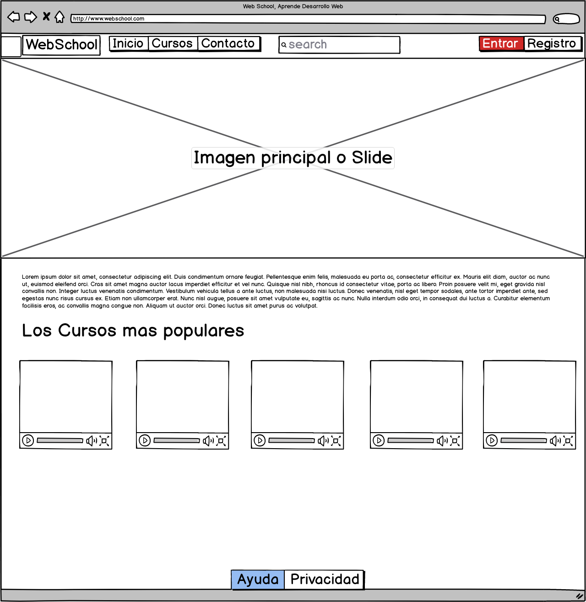

# Documentacion Pagina
Repositorio de La Documentacion de la Pagina

La pagina que se pidio crear es una pagina donde la idea es ofrecer cursos en linea, en nuestro caso visitamos varios sitios web dedicados a ofrecer cursos, ya sea gratitutos o de paga, por ejemplo, [Falcon Masters](https://www.falconmasters.com), [Udemy](https://www.udemy.com) y [Domestika](https://www.domestika.org)

## Sitemap

El mapa de sitio esta integrado por los siguientes elementos

- Index
  - Cursos
    - Categoria
      - Curso 1
      - Curso 2
      - Curso 3
  - Contacto
  - Ayuda
  - Privacidad

En todas las paginas se agregado la misma barra de navegacion con un motor de busqueda para encontrar cursos, tambien en la parte derecha se agregaron los botones de entrar y registro para invitar a los usuarios a recibir los beneficios de estar suscritos a la pagina. Todas las paginas funcionan de manera responsiva.

En todas las paginas se ha agregado el footer, en el cual se encuentran dos botones, uno es el de "Ayuda" en el cual se encuentran la solucion a problemas frecuentes que el usuario puede llegar a tener al navegar en nuestra pagina, y preguntas frecuentes que los usuarios llegan a tener.

Tambien se incluye privacidad, donde se informa nuestro Aviso de Privacidad.

---
### Inicio

En inicio decidimos agregar una breve bienvenida y explicacion de la funcion de la pagina, invitando a los visitantes a entrar a los cursos mas populares, en este caso se llegarian a mostrar los 5 cursos mas visitados.

La imagen principal, invita a aprender desarrollo web,

---
### Cursos

En el modulo de cursos se pueden apreciar 3 categorias de cursos; las cuales son:

  1. Los mejores cursos de "Desarrollo".
  2. Los mejores cursos de "Aplicaciones móviles".
  3. Los mejores cursos de "Informática y software".

Cada categoria cuenta con una paginacion para que el visitante no se encuentre limitado a los cursos mas populares.

---
### Contacto

En el modulo de contacto se encuentra un formulario en el cual el visitante podra aportar opiniones, quejas y sujerencias a nuesto sitio de cursos, igual se puede apreciar nuestra direccion y ubicacion para que las personas interesadas en nuestra pagina, tal como dar subir sus propios cursos o hacer "Negocios" con nosotros.

